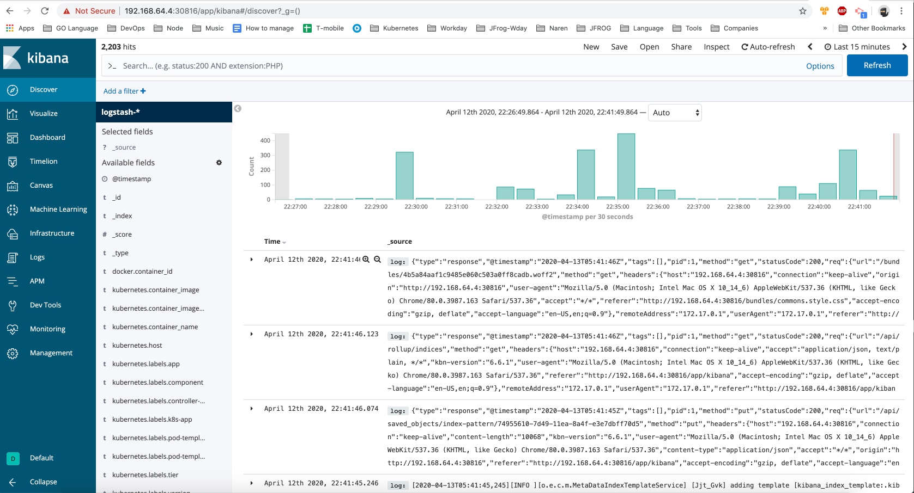

# Introduction to kubernetes

## Install Minikube

* To check if virtualization is supported on macOS, run the following command on your terminal.

```bash
sysctl -a | grep -E --color 'machdep.cpu.features|VMX' 
```

If you see VMX in the output (should be colored), the VT-x feature is enabled in your machine.

* Install Minikube
The easiest way to install Minikube on macOS is using Homebrew:

```bash
brew install minikube
```

* Start minikube with hyperkit

```bash
minikube start --vm-driver=hyperkit
```

* Check the status of the cluster:

```bash
minikube status
```

* Check minikube version:

```bash
minikube version
```

* Enable minikube dashboard:

```bash
minikube dashboard
```

* Install kubectl:
```bash
brew install kubectl

kubectl version
```

* Cluster information:
```bash
kubectl cluster-info
```

* Change namespace to `kube-system`
```bash
kubectl config set-context --current --namespace=kube-system
```

* Create deployments and services for `elasticsearch` and `kibana`  
```bash
kubectl apply -f elasticsearch.yml
kubectl apply -f kibana.yml
```

* Check deployment 
```bash
kubectl get deployment
```

* Check services 
```bash
kubectl get services
```

* Get Kibana URL
```bash
export NODE_PORT=$(kubectl get -o jsonpath="{.spec.ports[0].nodePort}" services kibana)

export NODE_IP=$(minikube ip)

echo http://$NODE_IP:$NODE_PORT/
```

Open printed URL in browser to access Kibana Dashboard. 

* Describe deployment
```bash
kubectl describe deployments elasticsearch-deployment
kubectl describe deployments kibana-deployment
```

* Describe pod
```bash
kubectl describe pod $POD_NAME
```

* Get pod logs
```bash
kubectl logs -f $POD_NAME
```

* Create DaemonSet for fluentd
```bash
kubectl apply -f daemonset.yml
```

* Check DaemonSet
```bash
kubectl get ds
```

* Refresh Kibana Dashboard in browser. 
```bash
echo http://$NODE_IP:$NODE_PORT/
```


* Delete deployment 
```bash
kubectl delete -f elasticsearch.yml
kubectl delete -f kibana.yml
```

* Delete deamonSet 
```bash
kubectl delete -f daemonset.yml
```
